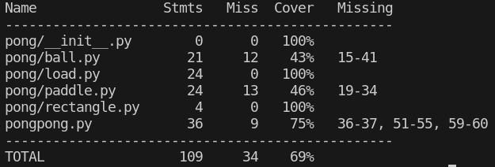
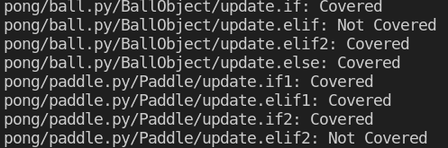
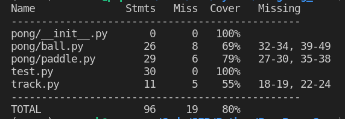
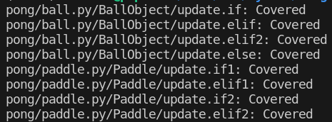

# Report for Assignment 1

## Project chosen

Name: Python

URL: <https://github.com/geekcomputers/Python>

Number of lines of code and the tool used to count it: <31429>

Programming language: Python

## Coverage measurement

### Existing tool

<Coverage.py>

### Your own coverage tool

<The following is supposed to be repeated for each group member>

<Francis>

BinaryExponentiation

<https://github.com/Timmermans13/Python/blob/master/power_of_n.py>

is_balanced

<https://github.com/Timmermans13/Python/blob/master/balance_parenthesis.py>

<Tim>

linear search

<https://github.com/Timmermans13/Python/blob/master/linear search.py>

num-py

<https://github.com/Timmermans13/Python/blob/master/num-py.py>

## Coverage improvement

### Individual tests

<The following is supposed to be repeated for each group member>

<Francis >

<Test 1: pow-test-one>

<https://github.com/Timmermans13/Python/blob/Francis-Branch/power_of_n.py>

<The test I have provided tests the with the branch where n is equal to 0 (pow-case-1). This was the only branch that was not covered, hence improving the branch coverage to 100%>

<Test 2: bal_case-two-test>

<https://github.com/Timmermans13/Python/blob/Francis-Branch/balance_parenthesis.py>

<The test I have provided tests the with the branch where the string empty (bal-case-2). This was the only branch that was not covered, hence improving the branch coverage to 100%>

<Tim>

<Test 1: linear search>

<https://github.com/Timmermans13/Python/blob/master/linear search.py>

<The test I have provided tests the function when the letter is not in the array. For this I chose the letter Z. with makeing the new secont test the branch coverage is improved to 100%>

<Test 2: num-py>

<https://github.com/Timmermans13/Python/blob/master/num-py.py>

<The test I have provided tests the function when the array is not equal that means both the print statements get hit and the coverage is 100%>

<Connor>

Pre-test coverage

Pre-test branches

Post-test coverage

Post-test branches

Code added: track.py, test.py
Code modified: pongpong.py, ball.py, paddle.py

### Overall

Old cov:

Francis:

Tim:

New cov:

Francis:

Tim:

<Provide a screenshot of the new coverage results by running the existing tool using all test modifications made by the group>

## Statement of individual contributions

Francis: I have made coverage measurements of two functions and
I have addedone test case for each function to improve the coverage.

Tim: I have done the coverage measurements of two functio and added test cases for the improvement of the coverage.

## Stan

Test 1: industrial_developed_hangman

Pre-test coverage

Pre-test function branches that were hit

Post-test branches hit

Post-test coverage

Test 2: TIC_TAC_TOE

Pre-test coverage

Pre-test function branches that were hit

Post-test branches that were hit

Post-test coverage

## Statement of individual contributions

Stan: I have made coverage measurements of two functions and
I have added one test case for each function to improve the coverage.
